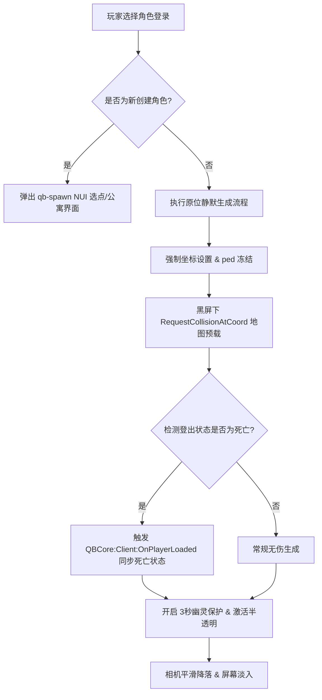

# v0.7 硬核原位登录与极端情况防范重生系统

## 版本目标

在沙盒社会体系与领袖机制建立后，为了将服务器的真实感与沉浸感推向硬核角色扮演（Hardcore RP）的终极形态，本版本将全面重构玩家进入服务器的重生与生成逻辑。通过强制“原位登录”杜绝利用重登进行“瞬间移动/免费跑图”的作弊行为，并设计一套无缝的“幽灵保护期”与“全 rendered 地图相机降落”机制，提供殿堂级的沉浸体验，同时建立覆盖 100% 极端边缘卡死情况的自动化防护网。

---

## 实施范围

- **硬核原位登录路由 (Hardcore Spawn Router)**：
  - 老玩家（已有角色数据，无论健康或倒地）登录时，**100% 自动拦截并静默处理**，跳过 NUI 选点 UI 界面，强制在其上次退服的精确坐标（或房产内部）生成。
  - 新玩家（首次创建角色）登录时，放行流程，允许其通过 UI 正常选择第一套初始公寓并进入游戏。
- **幽灵防护与物理穿透引擎 (Ghost Protection System)**：
  - 玩家生成后立即获得 3 秒的“幽灵状态”，角色 Ped 呈现 150 Alpha 半透明虚影。
  - 保护期内强制开启无敌状态 (`SetEntityInvincible`)，并动态屏蔽与周围所有玩家、NPC 和载具的实体碰撞，防止被车辆撞击或卡在模型内。
- **极致无瑕画面加载序列 (Immersive Fading & Rendering)**：
  - 玩家传送或加载时，屏幕保持绝对黑屏（`DoScreenFadeOut(0)`）。
  - 在黑屏保护下主动挂起代码，使用 `RequestCollisionAtCoord` 等待地表三维碰撞体完全加载完毕。
  - 碰撞体就绪后，在黑屏下解除冻结，在镜头从高空垂直下落（Sky Cam Drop）的起点处同时执行屏幕淡入，呈献流畅无瑕的视听降落体验，完全隐藏贴图加载和建模闪烁。
- **全方位极端边缘情况防范预案 (Edge-Case Safeguards)**：
  - **地底/虚空坠落保护**：检测 Z 轴坐标，若低于 `-100.0` 自动拉回最近的地表安全点（如 Legion Square）。
  - **高速公路生成修正**：自动识别高等级路网坐标，登入时将玩家生成点自动向道路两侧的安全停靠带偏移 2-3 米，避免出生在路中央。
  - **海洋/高空断线修正**：深海重登自动提供 15 秒“无限肺活量/水下呼吸”Buff；高空重登自动提供一次性降落伞。
  - **Combat Logging 逃跑审计**：结合数据库，强退时锁定玩家手铐、血量及受伤元数据；对于在受伤/交火状态下强退的玩家，自动向 Discord 管理日志发送警告审计。

---

## 开发模块/资源修改

- **`qb-spawn` (玩家重生控制)**：
  - 修改 `client.lua` 以实现：
    - `isNewCharacter` 状态拦截器。
    - `StartSpawnProtection` 协程线程（Alpha 控制、动态碰撞禁用循环）。
    - 结合 `Z轴` 和 `路网` 的坐标安全修正算法。
- **`qb-multicharacter` (角色多开)**：
  - 确认老角色加载回调数据结构中，精确坐标 `position` 能够被 client 端 `qb-spawn` 完好接收。
- **`qb-apartments` (公寓) & `qb-houses` (玩家房产)**：
  - 保持兼容。当老玩家处于“房产内登出”状态时，跳过 UI 选择，直接静默调用公寓/房产进入事件。

---

## 模块架构与联动逻辑

### 1. 智能路由派发机制 (The Spawn Router)



### 2. 幽灵保护物理逻辑 (Ghost Phase Mechanics)
在保护期内，利用客户端的 `GetGamePool('CPed')` 和 `GetGamePool('CVehicle')` 获取局域网内的所有活跃实体。在 3 秒的时间窗口内，每帧循环调用：
```lua
SetEntityNoCollisionEntity(playerPed, otherEntity, true)
```
此方法能确保玩家身体完全不受周围物理环境的推力影响，其他车辆会像穿过空气一样穿过玩家，从而在网络同步延迟或地图未加载时提供绝对的物理安全。

---

## 极端情况防护网设计规范

### 1. 虚空防坠伞 (Anti-Void Fall)
* **算法定义**：
  在 `qb-spawn` 恢复玩家自由的瞬间，启动一个后台监测器。一旦读得玩家 Ped 的高度 `Z < -100`，立即触发警报：
  ```lua
  local safeCoords = vector3(185.0, -950.0, 30.0) -- 市中心广场 Legion Square 默认安全点
  SetEntityCoords(ped, safeCoords.x, safeCoords.y, safeCoords.z)
  ```
  并伴随短暂的通知：“检测到空间裂缝，您已被安全引力拉回市区。”

### 2. 高速路两侧溢出修正 (Highway Offset)
* **算法定义**：
  若玩家掉线坐标位于高速路网（通过 `GetVehicleNodeProperties` 取得道路类型为高速路段），生成算法会向玩家左侧或右侧进行 Vector 偏移：
  ```lua
  local heading = GetEntityHeading(ped)
  local offsetVector = GetAnimInitialOffsetPosition("move_m@injured", "sidestep_l", coords.x, coords.y, coords.z, 0.0, 0.0, heading, 0.0, 2)
  -- 将坐标向人行道/应急车道修正
  ```

### 3. Combat Logging 防治与 OOC 封禁联动
* **机制说明**：
  QBCore 原生核心会在玩家离开时，自动保存其 `isdead` 与 `inlaststand` 属性。
  为防止玩家通过重登来“逃避抢劫/击杀”，服务器必须建立 Discord Webhook 联合审计：
  - 当 `PlayerDropped` 触发时，若玩家处于残血（Health < 120）或戴手铐状态，向 `admin-log` 频道发布红色预警：
    > **⚠️ Combat Logging 警告**：玩家 [张三] (CitizenID: ABC12345) 在交火/被拷状态下退服，已强制锁定其重登时的受伤状态，请管理员跟进调查是否 Fail RP。

---

## 验收标准

- 老角色登录时，屏幕必须在 0 毫秒内进入全黑，期间没有任何闪烁或游戏原版画面的“惊鸿一瞥”。
- 老玩家上线后，身体必须呈现 3 秒的半透明虚影，且在这 3 秒内，任何高速驶过的车辆必须 100% 穿透玩家，玩家不发生位移也不损失血量。
- 在沙滩海中下线的玩家，重登时能够正常获得气泡框且 15 秒内不因溺水掉血。
- 新角色登录能够正常加载并自由选择第一套初始公寓。
- 在地底下线的测试玩家，重登后能够自动在 Legion Square 完好无损地出生。

---

## 风险点

- **虚空拉回的误判风险**：玩家如果在正常的超深地下防空洞、地下矿井或某些 MLO 的地下负二层下线，Z 轴可能会低于判定标准，导致重登时被误传送至市中心。
  - *规避方案*：在防坠检测中，加入“白名单区域坐标包围盒”，对合法的深层地下建筑坐标点进行免除判定。
- **碰撞禁用在极度拥挤时的卡边风险**：当 3 秒幽灵期结束、碰撞体恢复的瞬间，如果玩家正巧重合在某辆大货车正中央，可能会卡在模型内部。
  - *规避方案*：幽灵期结束的瞬间，若检测到玩家 Ped 与任何大体积载具发生“重合（IsEntityTouchingEntity）”，自动将幽灵期延长 2 秒，直到玩家主动走出载具范围再恢复碰撞。
