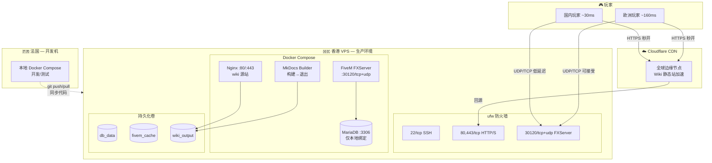

# 🚀 T-City 生产部署架构设计书

> **修订日期**: 2026-06-05  
> **适用版本**: v2.0+  
> **维护人/Agent**: Reasonix Code  
> **状态**: 设计中 / 待实施

---

## 🎯 概述

为 T-City 角色扮演服务器设计一套 **Docker Compose** 驱动的生产部署方案。三核心容器（MariaDB / FiveM FXServer / Nginx）+ Wiki 构建器（短生命周期容器），实现一键启动、环境一致、安全隔离。

---

## 🗺️ 1. 系统架构总览

### 1.0 服务器拓扑



### 1.1 跨国延迟基线

服务器在香港，玩家分处中欧两地：

| 路径 | 延迟 | RP 体验 |
|:---|:---|:---|
| 国内（上海）→ 香港 | ~30ms | ⭐⭐⭐ 完美 |
| 国内（北京/联通）→ 香港 | ~40ms | ⭐⭐⭐ 完美 |
| 欧洲（法兰克福）→ 香港 | ~170ms | ⭐⭐ 走路/对话/UI 无感，驾驶轻微延迟，枪战吃亏 |
| 欧洲（巴黎）→ 香港 | ~160ms | ⭐⭐ 同上 |
| 管理员（法国 SSH）→ 香港 | ~160ms | ✅ 终端操作无感，Web 面板无感 |

**核心判断**：国内玩家是主力群体（~30ms），香港是最优位置。欧洲少数玩家 160ms 在 Serious RP 场景下（走路/对话/经济/UI）完全可接受，仅在 PvP 枪战中处于劣势 — 而 T-City 是 RP 服务器，枪战不是主循环。

### 1.2 香港机房选型

| 提供商 | 线路类型 | 国内延迟 | 欧洲延迟 | 推荐 |
|:---|:---|:---|:---|:---|
| **阿里云香港** | CN2 GIA + 国际 BGP | ~30ms | ~170ms | ⭐⭐⭐ 首选 |
| **腾讯云香港** | CN2 + 国际 BGP | ~30ms | ~175ms | ⭐⭐⭐ |
| 搬瓦工香港 CN2 GIA | 纯 CN2 GIA | ~25ms | ~170ms | ⭐⭐ 性价比高 |
| Vultr 新加坡 | 普通 BGP | ~70ms | ~150ms | ⭐ 对国内北方较差 |

**必须选择 CN2 GIA 线路** — 普通 BGP 线路在国内晚高峰时段丢包率可达 10-30%，UDP 游戏流量会严重受影响。

### 1.3 Cloudflare CDN — Wiki 全球加速

Wiki 是纯静态站点，天然适合 CDN 全局分发：

```
玩家请求 wiki.t-city.com
        │
        ▼
┌──────────────────────────────────┐
│  Cloudflare DNS (橙色云朵模式)    │
│  自动路由到最近的边缘节点          │
│                                  │
│  巴黎玩家 → 巴黎边缘节点 (5ms)    │
│  上海玩家 → 香港/东京节点 (10ms)  │
│  伦敦玩家 → 伦敦边缘节点 (3ms)    │
└──────────────┬───────────────────┘
               │ 缓存命中 → 直接返回
               │ 缓存未命中 → 回源香港 Nginx
               ▼
      香港 Nginx (源站)
```

**配置要点**：
- Cloudflare DNS 开启代理（橙色云朵），隐藏源站 IP
- Page Rules：`wiki.t-city.com/assets/*` → Cache Level: Cache Everything, Edge Cache TTL: 30 days
- 源站 Nginx 保持 SSL，Cloudflare 与源站之间也用 HTTPS（Full 模式）
- 纯静态内容不怕缓存，改内容时手动 Purge Cache 或等 TTL 过期

### 1.4 法国本地开发环境

管理员在法国开发时，本地运行完整的 Docker Compose 进行功能测试，再推送到香港生产环境：

```
法国开发机                         香港生产 VPS
┌─────────────────────┐          ┌─────────────────────┐
│ docker compose up    │          │ docker compose up    │
│                     │  git     │                     │
│ FXServer :30120     │  push    │ FXServer :30120     │
│ MariaDB  :3306      │ ──────→  │ MariaDB  :3306      │
│ Nginx    :80        │  GitHub  │ Nginx    :80/443    │
│                     │          │ Cloudflare CDN ←────│
│ 你连 localhost 测试  │          │                     │
│ 延迟 0ms，完美开发   │  git pull│ 国内玩家主力         │
└─────────────────────┘  ←────── └─────────────────────┘
```

- `server.cfg` 中的 `mysql_connection_string` 指向本地 `db:3306`，两地一致
- 开发和生产的唯一区别：`.env` 中的密钥（测试用假 key，生产用真 key）
- 本地可以 `set sv_licenseKey "changeme"` 不消耗真实许可证

### 1.5 欧洲玩家的体验补偿策略

| 策略 | 说明 |
|:---|:---|
| **角色引导** | 引导欧洲玩家选择对延迟不敏感的角色：商人、市长、律师、医生、RP 剧情玩家 |
| **距离校验放宽** | 五层安全校验链中的物理距离检测，对高延迟玩家（>150ms）放宽 15% 的容差阈值 |
| **PvP 规则保护** | 如有跨洲 PvP 争议，优先采信低延迟方不构成规则优势的 RP 逻辑 |
| **Wiki 无障碍** | Cloudflare CDN 确保 Wiki 浏览中欧都是秒开 |

> **核心态度**：160ms 对 RP 服务器是**完全可以接受的延迟**。Walking / Talking / UI / 经济交易在这个延迟下毫无感知。FiveM 的 OneSync 网络层对 200ms 以内的玩家有良好的插值补偿。欧洲玩家唯一吃亏的场景是竞技性 PvP，而这在 Serious RP 中占比极低。

---

## 📦 2. 容器设计

### 2.1 容器矩阵

| 容器 | 镜像 | 生命周期 | 端口 | 资源限制 |
|:---|:---|:---|:---|:---|
| `tcity-db` | `mariadb:11.4` | 常驻 | `127.0.0.1:3306` | 1 GB RAM |
| `tcity-fivem` | 自定义 Dockerfile | 常驻 | `30120/tcp+udp` | 4 GB RAM |
| `tcity-nginx` | `nginx:alpine` | 常驻 | `80, 443` | 128 MB RAM |
| `tcity-wiki-builder` | 自定义 Dockerfile | 短生命周期 | 无 | 256 MB RAM |

### 2.2 FiveM 容器 Dockerfile

FiveM 需要特定 Linux 依赖。使用 `debian:bookworm-slim` + FXServer 手工部署：

```dockerfile
# fivem/Dockerfile
FROM debian:bookworm-slim

RUN apt-get update && apt-get install -y --no-install-recommends \
    wget xz-utils ca-certificates \
    libc6 libstdc++6 libgcc-s1 \
    libssl3 libcurl4 libmariadb3 \
    && rm -rf /var/lib/apt/lists/*

# FXServer artifacts（构建时下载或挂载）
# 生产环境建议通过卷挂载 /fxserver 目录，不打进镜像
RUN mkdir -p /fxserver /fxserver-data

WORKDIR /fxserver
EXPOSE 30120/tcp 30120/udp

ENTRYPOINT ["/fxserver/run.sh"]
CMD ["+exec", "server.cfg"]
```

### 2.3 Wiki 构建器 Dockerfile

```dockerfile
# wiki/Dockerfile
FROM python:3.12-alpine

RUN pip install --no-cache-dir \
    mkdocs \
    mkdocs-material \
    mkdocs-wikilinks-plugin \
    mkdocs-tags-plugin

WORKDIR /wiki
COPY mkdocs.yml .
CMD ["mkdocs", "build", "--clean"]
```

---

## 🐳 3. Docker Compose 完整编排

### 3.1 docker-compose.yml

```yaml
version: '3.8'

services:
  # ━━━━━━━━━━━━━━━━━━━━━━━━━━━━━━━━━━━━
  # MariaDB 数据库
  # ━━━━━━━━━━━━━━━━━━━━━━━━━━━━━━━━━━━━
  db:
    image: mariadb:11.4
    container_name: tcity-db
    restart: unless-stopped
    env_file: .env
    volumes:
      - db_data:/var/lib/mysql
      - ./db/init:/docker-entrypoint-initdb.d:ro
      - ./db/conf.d:/etc/mysql/conf.d:ro
    ports:
      - "127.0.0.1:3306:3306"
    healthcheck:
      test: ["CMD", "mariadb-admin", "ping", "-h", "localhost", "-u", "root", "-p${DB_ROOT_PASSWORD}"]
      interval: 10s
      timeout: 5s
      retries: 5

  # ━━━━━━━━━━━━━━━━━━━━━━━━━━━━━━━━━━━━
  # FiveM FXServer
  # ━━━━━━━━━━━━━━━━━━━━━━━━━━━━━━━━━━━━
  fivem:
    build:
      context: ./fivem
      dockerfile: Dockerfile
    container_name: tcity-fivem
    restart: unless-stopped
    depends_on:
      db:
        condition: service_healthy
    env_file: .env
    ports:
      - "30120:30120/tcp"
      - "30120:30120/udp"
    volumes:
      - ./T-CityLite.base:/fxserver:ro           # 资源文件只读
      - fivem_cache:/fxserver/cache               # 缓存独立卷
      - ./server-data:/fxserver-data              # 持久化玩家数据
    tmpfs:
      - /tmp:exec

  # ━━━━━━━━━━━━━━━━━━━━━━━━━━━━━━━━━━━━
  # MkDocs Wiki 构建器
  # ━━━━━━━━━━━━━━━━━━━━━━━━━━━━━━━━━━━━
  wiki-builder:
    build:
      context: ./wiki
      dockerfile: Dockerfile
    container_name: tcity-wiki-builder
    volumes:
      - ./tcity-wiki/content:/wiki/content:ro
      - ./tcity-wiki/mkdocs.yml:/wiki/mkdocs.yml:ro
      - wiki_output:/wiki/site
    command: ["build", "--clean"]

  # ━━━━━━━━━━━━━━━━━━━━━━━━━━━━━━━━━━━━
  # Nginx Web 服务
  # ━━━━━━━━━━━━━━━━━━━━━━━━━━━━━━━━━━━━
  nginx:
    image: nginx:alpine
    container_name: tcity-nginx
    restart: unless-stopped
    depends_on:
      wiki-builder:
        condition: service_completed_successfully
    ports:
      - "80:80"
      - "443:443"
    volumes:
      - ./nginx/nginx.conf:/etc/nginx/nginx.conf:ro
      - ./nginx/sites:/etc/nginx/conf.d:ro
      - ./nginx/ssl:/etc/nginx/ssl:ro
      - wiki_output:/var/www/tcity-wiki:ro

volumes:
  db_data:
    driver: local
  fivem_cache:
    driver: local
  wiki_output:
    driver: local
```

### 3.2 .env.template

```bash
# ━━━━━━━━━━━━━━━━━━━━━━━━━━━━━━━━━━━━
# T-City 生产环境配置
# 复制为 .env 并填入真实值
# .env 已加入 .gitignore，不会提交
# ━━━━━━━━━━━━━━━━━━━━━━━━━━━━━━━━━━━━

# MariaDB
DB_ROOT_PASSWORD=CHANGE_ME_ROOT_PASSWORD_32CHARS
DB_NAME=tcity
DB_USER=tcity_app
DB_PASSWORD=CHANGE_ME_APP_PASSWORD_32CHARS

# FiveM 许可证
FIVEM_LICENSE_KEY=CHANGE_ME_FIVEM_LICENSE
STEAM_WEB_API_KEY=CHANGE_ME_STEAM_API_KEY

# 域名 (Nginx server_name)
WIKI_DOMAIN=wiki.t-city.com
```

---

## 🌐 4. Nginx 配置

### 4.1 主配置 nginx.conf

```nginx
user nginx;
worker_processes auto;
pid /run/nginx.pid;

events {
    worker_connections 1024;
    multi_accept on;
}

http {
    include /etc/nginx/mime.types;
    default_type application/octet-stream;

    # 安全头
    add_header X-Content-Type-Options "nosniff" always;
    add_header X-Frame-Options "SAMEORIGIN" always;
    add_header X-XSS-Protection "1; mode=block" always;
    add_header Referrer-Policy "strict-origin-when-cross-origin" always;

    # 性能
    sendfile on;
    tcp_nopush on;
    gzip on;
    gzip_types text/plain text/css application/json application/javascript text/xml application/xml text/markdown;
    gzip_min_length 256;

    # 限流（防爬虫/滥用）
    limit_req_zone $binary_remote_addr zone=wiki:10m rate=60r/m;
    limit_conn_zone $binary_remote_addr zone=conn_limit:10m;

    include /etc/nginx/conf.d/*.conf;
}
```

### 4.2 Wiki 站点配置 sites/wiki.conf

```nginx
server {
    listen 80;
    server_name wiki.t-city.com;

    # 强制 HTTPS（生产环境）
    return 301 https://$host$request_uri;
}

server {
    listen 443 ssl http2;
    server_name wiki.t-city.com;

    ssl_certificate     /etc/nginx/ssl/fullchain.pem;
    ssl_certificate_key /etc/nginx/ssl/privkey.pem;
    ssl_protocols TLSv1.2 TLSv1.3;
    ssl_ciphers HIGH:!aNULL:!MD5;

    root /var/www/tcity-wiki;
    index index.html;

    # 速率限制
    limit_req zone=wiki burst=30 nodelay;
    limit_conn conn_limit 20;

    # 缓存静态资源
    location /assets/ {
        expires 30d;
        add_header Cache-Control "public, immutable";
    }

    # MkDocs Material 的搜索索引
    location /search/ {
        expires 1h;
    }

    # 主内容
    location / {
        try_files $uri $uri/ $uri.html =404;
    }

    # 自定义 404 页（如果有的话）
    error_page 404 /404.html;
    error_page 500 502 503 504 /50x.html;
}
```

---

## 🗄️ 5. 数据库初始化

### db/init/01-schema.sql

```sql
-- 核心玩家表（与 QBCore 兼容）
CREATE TABLE IF NOT EXISTS players (
    citizenid VARCHAR(50) PRIMARY KEY,
    license VARCHAR(50) NOT NULL UNIQUE,
    name VARCHAR(100),
    money JSON NOT NULL DEFAULT '{"cash":0,"bank":0,"crypto":0}',
    job JSON NOT NULL DEFAULT '{"name":"unemployed","grade":0}',
    gang JSON NOT NULL DEFAULT '{"name":"none","grade":0}',
    metadata JSON NOT NULL DEFAULT '{}',
    charinfo JSON NOT NULL DEFAULT '{}',
    last_updated TIMESTAMP DEFAULT CURRENT_TIMESTAMP ON UPDATE CURRENT_TIMESTAMP,
    INDEX idx_license (license),
    INDEX idx_last_updated (last_updated)
) ENGINE=InnoDB DEFAULT CHARSET=utf8mb4 COLLATE=utf8mb4_unicode_ci;

-- 经济流水表
CREATE TABLE IF NOT EXISTS economy_transactions (
    id BIGINT AUTO_INCREMENT PRIMARY KEY,
    citizenid VARCHAR(50) NOT NULL,
    amount INT NOT NULL,
    balance_new INT NOT NULL,
    account_type ENUM('cash','bank','crypto') NOT NULL,
    reason VARCHAR(255),
    source_identifier VARCHAR(50),
    created_at TIMESTAMP DEFAULT CURRENT_TIMESTAMP,
    INDEX idx_citizenid_time (citizenid, created_at),
    INDEX idx_created_at (created_at)
) ENGINE=InnoDB DEFAULT CHARSET=utf8mb4 COLLATE=utf8mb4_unicode_ci;

-- 日志审计表
CREATE TABLE IF NOT EXISTS audit_log (
    id BIGINT AUTO_INCREMENT PRIMARY KEY,
    event_type VARCHAR(50) NOT NULL,
    citizenid VARCHAR(50),
    source INT,
    details JSON,
    created_at TIMESTAMP DEFAULT CURRENT_TIMESTAMP,
    INDEX idx_event_type_time (event_type, created_at)
) ENGINE=InnoDB DEFAULT CHARSET=utf8mb4 COLLATE=utf8mb4_unicode_ci;
```

---

## 🔄 6. 部署工作流

### 6.1 首次部署（香港生产环境）

```bash
# 0. 前置条件：VPS 已安装 Docker + Docker Compose
#    curl -fsSL https://get.docker.com | sh
#    apt install docker-compose-plugin

# 1. 登录香港 VPS，克隆仓库
git clone <repo-url> /opt/tcity
cd /opt/tcity

# 2. 配置环境变量
cp .env.template .env
vim .env   # 填入真实密钥和密码

# 3. 配置 FiveM 服务器
cp T-CityLite.base/server.cfg.template T-CityLite.base/server.cfg
vim T-CityLite.base/server.cfg
#   填入 sv_licenseKey (从 keymaster.fivem.net)
#   填入 mysql_connection_string "mysql://tcity_app:密码@db:3306/tcity?charset=utf8mb4"
#   填入 steam_webApiKey (从 steamcommunity.com/dev/apikey)

# 4. 配置 Nginx SSL 证书（Let's Encrypt）
apt install certbot
# 先确保 nginx 没在跑，certbot 需要绑定 80 端口
certbot certonly --standalone -d wiki.t-city.com
mkdir -p nginx/ssl
cp /etc/letsencrypt/live/wiki.t-city.com/fullchain.pem nginx/ssl/
cp /etc/letsencrypt/live/wiki.t-city.com/privkey.pem nginx/ssl/
# 设置证书自动续期 cron
# 0 3 * * * certbot renew --quiet && docker compose restart nginx

# 5. 拉取 FiveM artifacts
# 从 https://runtime.fivem.net/artifacts/fivem/build_proot_linux/master/
# 下载最新 fx.tar.xz，解压到 fivem/artifacts/
mkdir -p fivem/artifacts
cd fivem/artifacts
wget <最新版本 URL>
tar xf fx.tar.xz
cd /opt/tcity

# 6. 启动全部服务
docker compose up -d

# 7. 检查状态
docker compose ps
# 预期: tcity-db (healthy), tcity-fivem (running), tcity-nginx (running)
docker compose logs fivem | tail -20

# 8. 配置 Cloudflare CDN
#    - 域名 DNS 改为 Cloudflare，开启橙色代理
#    - SSL/TLS 设为 Full 模式
#    - Page Rules: wiki.t-city.com/assets/* → Cache Everything

# 9. 验证
#    - 浏览器访问 https://wiki.t-city.com
#    - FiveM 客户端直连服务器 IP:30120 或域名
```

### 6.1bis 法国本地开发环境

```bash
# 法国开发机上，同样可以用 Docker Compose 启动完整服务
cd /opt/tcity

# 使用测试密钥（不需要真实 FiveM 许可证）
cp .env.template .env
# .env 中填本地测试用的假密码即可

cp T-CityLite.base/server.cfg.template T-CityLite.base/server.cfg
# server.cfg 中 sv_licenseKey 可以填 "changeme"
# mysql_connection_string 用 "mysql://tcity_app:密码@db:3306/tcity?charset=utf8mb4"

# 本地无需 Nginx SSL（或自签证书）
# 跳过 certbot 步骤，直接用 http://localhost 访问 wiki

docker compose up -d
# 本地 FiveM 客户端连接 localhost:30120
```

**两地差异仅两处**：`.env` 中的密码（测/产不同）、`server.cfg` 中的许可证 key（真/假不同）。其余文件完全一致。

### 6.2 日常更新

**法国开发 → GitHub → 香港生产**的标准工作流：

```bash
# ═══════════════════════════════════════
# 法国本地：开发 + 测试 + 推送
# ═══════════════════════════════════════
cd /opt/tcity
# ... 修改代码 ...
git add -A
git commit -m "feat: 新功能描述"
git push origin main

# ═══════════════════════════════════════
# 香港生产：拉取 + 重启
# ═══════════════════════════════════════
ssh root@hk-server
cd /opt/tcity
git pull origin main

# 场景 A: 仅 Wiki 内容更新
docker compose up wiki-builder     # 重新构建
docker compose restart nginx       # 刷新
# Cloudflare 缓存：如急需刷新，在 Cloudflare Dashboard → Caching → Purge Everything

# 场景 B: 游戏资源更新（Lua 脚本、配置）
docker compose restart fivem       # 重启游戏服务

# 场景 C: 数据库迁移
docker compose exec db mariadb -u root -p tcity < migrations/new_migration.sql
docker compose restart fivem

# 场景 D: 全部更新（Dockerfile / docker-compose.yml 变更）
docker compose up -d --build

# 场景 E: 仅重启某个服务
docker compose restart nginx       # 刷新 wiki
docker compose restart fivem       # 重启游戏
```

> **一次编写，到处运行**：同一份代码在法国开发机的 Docker Compose 和香港 VPS 的 Docker Compose 中行为完全一致，消除了"我本地能跑，服务器不行"的问题。

### 6.3 备份与恢复

```bash
# 备份
docker compose exec db mariadb-dump --all-databases -u root -p${DB_ROOT_PASSWORD} > backup_$(date +%Y%m%d).sql
tar czf backup_data_$(date +%Y%m%d).tar.gz server-data/

# 恢复数据库
docker compose exec -T db mariadb -u root -p${DB_ROOT_PASSWORD} < backup_20260605.sql

# 恢复玩家数据
tar xzf backup_data_20260605.tar.gz -C /opt/tcity/
docker compose restart fivem
```

---

## 🛡️ 7. 安全硬化和监控

### 7.1 防火墙规则

```bash
# ufw 规则
ufw default deny incoming
ufw default allow outgoing
ufw allow 22/tcp
ufw allow 80/tcp
ufw allow 443/tcp
ufw allow 30120/tcp
ufw allow 30120/udp
ufw enable
```

### 7.2 容器安全

| 措施 | 配置 |
|:---|:---|
| 数据库端口绑定 | `127.0.0.1:3306` — 仅宿主机可访问 |
| 资源文件 | FiveM 资源卷挂载为 `:ro` (只读) |
| 环境变量 | 密钥通过 `.env` 注入，不硬编码 |
| Nginx 限流 | 每个 IP 60 req/min，burst 30 |
| 日志轮换 | Docker `json-file` driver + `max-size: 10m` |

### 7.3 建议监控

```yaml
# docker-compose.yml 追加（可选）
  prometheus:
    image: prom/prometheus
    # ... 采集宿主机和容器指标

  grafana:
    image: grafana/grafana
    # ... 可视化面板
```

**轻量替代方案**：在宿主机上用 `htop` + `docker stats` + `cron` 日志轮换即可，避免重型监控栈的维护负担。

---

## ⚙️ 8. 四原则对齐检查

### 8.1 模块化 (Modularity)

- ✅ 三个常驻容器独立配置、独立重启、独立升级
- ✅ Wiki 构建器是短生命周期容器，与运行时解耦
- ✅ 每个服务有独立的健康检查，依赖链清晰
- ✅ `configs/modules/wiki.cfg` 注册游戏内 NUI Wiki，遵循模块白名单规范

### 8.2 高性能 (High Performance)

- ✅ Nginx 静态文件直出 + gzip + 缓存头，毫秒级响应
- ✅ FiveM 使用 `tmpfs` 临时文件系统，减少磁盘 I/O
- ✅ MariaDB 同机部署，通过 Docker 内部 DNS 解析 `db`，延迟 < 1ms
- ✅ 静态资源分离（`/assets/` 30 天缓存），减少带宽
- ✅ Wiki 构建器仅在内容变更时运行，不常驻消耗资源

### 8.3 安全 (Security)

- ✅ 四层防护：VPS 安全组 → ufw → Docker 网络隔离 → Nginx 安全头
- ✅ 数据库不暴露公网，仅绑定 `127.0.0.1`
- ✅ 密钥通过 `.env` 注入，`.gitignore` 保障不泄露
- ✅ Nginx 限流防爬，SSL/TLS 1.2+ 加密
- ✅ FiveM 资源文件只读挂载，防止运行时篡改

### 8.4 可拓展 (Extensibility)

- ✅ 新增服务：在 `docker-compose.yml` 加一个 service 块 + 如果对外暴露则加 Nginx server block
- ✅ 横向扩展：未来可拆分为多台 VPS（db 独立、fivem 独立、web 独立），Docker Compose → Docker Swarm / k8s 平滑过渡
- ✅ 环境一致性：本地开发 `docker compose up` 和生产环境行为完全一致

---

## 📋 9. 文件变更清单

```
新增:
  docker-compose.yml                    ← 主编排文件
  .env.template                         ← 环境变量模板
  fivem/Dockerfile                      ← FiveM 容器镜像
  wiki/Dockerfile                       ← MkDocs 构建器镜像
  nginx/                                ← Nginx 配置目录
  ├── nginx.conf
  ├── sites/wiki.conf
  └── ssl/                               ← 证书目录 .gitignore
  db/
  ├── init/01-schema.sql                ← 数据库初始化
  └── conf.d/custom.cnf                 ← MariaDB 自定义配置
  scripts/
  ├── deploy.sh                         ← 一键部署
  └── backup.sh                         ← 自动备份

修改:
  .gitignore                             ← 添加 .env, nginx/ssl/, server-data/

无删除项（所有现有文件保持不变）
```

---

## 🚦 10. 就绪检查清单

### 10.1 香港生产环境

部署前确认以下项全部就绪：

- [ ] 香港 VPS 已购买（阿里云/腾讯云 CN2 GIA 线路，≥4 核 8 GB RAM）
- [ ] VPS 已安装 Docker + Docker Compose
- [ ] 域名 `wiki.t-city.com` 已解析到 VPS IP 并在 Cloudflare 开启橙色代理
- [ ] FiveM 许可证密钥已从 [keymaster.fivem.net](https://keymaster.fivem.net) 获取
- [ ] Steam Web API Key 已从 [steamcommunity.com](https://steamcommunity.com/dev/apikey) 获取
- [ ] `.env` 已从 `.env.template` 复制并填入真实值
- [ ] `server.cfg` 已从 `server.cfg.template` 复制并填入真实值
- [ ] SSL 证书已通过 certbot 获取并放入 `nginx/ssl/`，cron 自动续期已配置
- [ ] Cloudflare SSL/TLS 设为 Full 模式
- [ ] `docker compose up -d` 成功启动，三个容器 `healthy` / `running`
- [ ] 浏览器访问 `https://wiki.t-city.com` 可看到 Wiki 首页（CDN 缓存生效）
- [ ] FiveM 客户端可从国内和欧洲连接到服务器

### 10.2 法国本地开发环境

- [ ] Docker + Docker Compose 已安装
- [ ] `git clone` 仓库到本地
- [ ] `.env` + `server.cfg` 已配置（测试用假密钥）
- [ ] `docker compose up -d` 成功启动
- [ ] FiveM 客户端 `connect localhost:30120` 可进入游戏
- [ ] `http://localhost` 可看到 Wiki

---

> **下一步**：本设计书审批通过后，依次执行：创建 `tcity-deploy/` 目录并写入配置文件 → 撰写 `deploy.sh` 自动化脚本 → 与 Wiki 设计规格书联动（Wiki 内容路径对齐）。
