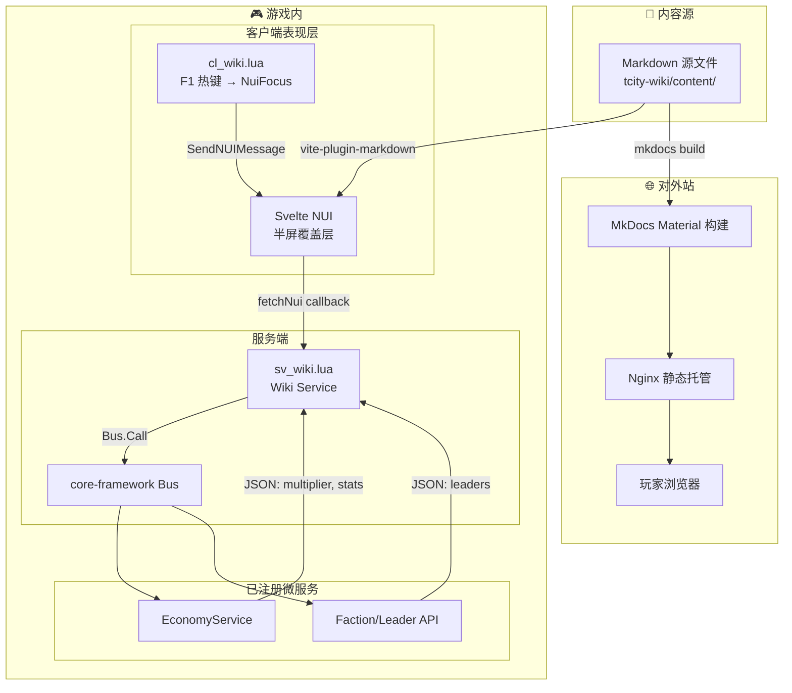

# 📖 T-City Wiki 系统设计规格书

> **修订日期**: 2026-06-05  
> **适用版本**: v2.0+  
> **维护人/Agent**: Reasonix Code  
> **状态**: 设计中 / 待实施

---

## 🎯 概述

为 T-City 服务器设计一套双通道 Wiki 系统：**对外 MkDocs 静态站**（浏览器访问，新人引流）+ **游戏内 NUI 面板**（F1 热键，玩家即时查阅）。两者共享同一套 Markdown 源文件，内容一次维护、两处消费。

Wiki 内容覆盖四大栏目：服务器介绍、游戏指引、城市档案（人物小传/阵营/历史事件）、开发日志。

---

## 🗺️ 1. 系统架构与数据流图



**数据流说明**：

1. **静态流**：Markdown 源文件通过 `vite-plugin-markdown` 在构建时打包进 NUI，无需服务端参与
2. **动态流**：NUI 打开时通过 `fetchNui` 回调 → 服务端 → Bus → 各微服务，获取实时游戏数据
3. **对外站**：同一套 `.md` 文件通过 `mkdocs build` 生成纯静态 HTML，部署到 Nginx

---

## 📐 2. 内容架构设计

### 2.1 四大栏目结构

```
tcity-wiki/content/              ← 唯一内容源
│
├── 01-server/                   ← OOC，面向潜在玩家
│   ├── index.md                   关于 T-City
│   ├── join.md                    如何加入（服务器地址、开白流程）
│   ├── rules.md                   服务器规则
│   └── faq.md                     常见问题
│
├── 02-guide/                    ← OOC + IC 混合
│   ├── index.md                   新人起航指南
│   ├── jobs.md                    职业大全
│   ├── economy.md                 宏观经济系统说明
│   ├── catalyst-cards.md          催化剂卡牌大全
│   ├── commands.md                常用指令速查表
│   └── faction-leadership.md      领袖系统与 KPI 考核
│
├── 03-lore/                     ← IC 为主，世界叙事
│   ├── index.md                   城市历史
│   ├── characters/                人物小传
│   │   ├── _template.md           人物小传模板
│   │   ├── mayor-past.md          历任市长
│   │   ├── police-chiefs.md       历任警长
│   │   └── legends.md             传奇市民
│   ├── factions/                  阵营档案
│   │   ├── _template.md           阵营页面模板
│   │   ├── lspd.md                洛圣都警察局
│   │   ├── ems.md                 急救医疗服务
│   │   └── cartels/               各帮派页面
│   └── events/                    历史大事件
│       ├── timeline.md            时间线
│       └── season-1.md            第一季回顾
│
└── 04-dev/                      ← OOC
    ├── index.md                   更新日志
    └── roadmap.md                 未来路线图
```

### 2.2 IC/OOC 视角分层

| 标识 | 含义 | 适用栏目 |
|:---|:---|:---|
| 🟢 **OOC** | 角色外，纯游戏机制说明 | 服务器介绍、开发日志 |
| 🟠 **IC** | 角色内，从城市视角叙述 | 城市历史、人物小传、阵营介绍 |
| 🔵 **混合** | IC 语气包装 OOC 教程 | 新手起航、经济系统说明 |

每篇文档在 YAML frontmatter 中标注 `ic_ooc` 字段，MkDocs 和 NUI 均可据此渲染不同的视觉标识。

### 2.3 人物小传模板

```markdown
---
title: "角色全名"
category: "characters"
tags: [警长, 第一季, 活跃]
ic_ooc: "IC"
last_updated: "2026-06-05"
---

# 🎭 [角色全名]

| 属性 | 内容 |
|:---|:---|
| **IC 姓名** | [角色名] |
| **身份** | [职位/帮派/称号] |
| **任期/活跃期** | [YYYY-MM ~ YYYY-MM 或 "至今"] |
| **玩家** | [OOC匿名 / 自愿公开] |
| **状态** | 🟢 活跃 / 🔴 退场 / ⚫ 已故 |

## 生平

[300-800 字叙事体，按起承转合结构]

## 主要成就/事件

- [事件 1]
- [事件 2]

## 关联人物

- [[人物A]] — [关系]
- [[人物B]] — [关系]
```

### 2.4 阵营/帮派页面模板

```markdown
---
title: "阵营名称"
category: "factions"
tags: [帮派, 活跃, 东区]
ic_ooc: "IC"
---

# 🏴 [阵营名称]

| 属性 | 内容 |
|:---|:---|
| **全称** | [正式名称] |
| **类型** | 街头帮派 / 合法组织 / 政府机构 |
| **势力范围** | [区域] |
| **创立时间** | [YYYY-MM] |
| **现任首领** | [[首领名]] |
| **状态** | 🟢 活跃 / 🔴 解散 |
| **敌对** | [[阵营A]]、[[阵营B]] |
| **联盟** | [[阵营C]] |

## 起源

[200-500 字背景叙事]

## 组织架构

- **首领** — [名字]
- **副手** — [名字]
- **骨干** — N 人
- **成员** — ~N 人

## 历史大事记

| 日期 | 事件 |
|:---|:---|
| YYYY-MM | [事件描述] |

## 著名成员

- [[成员A]] — [角色]
- [[成员B]] — [角色]
```

---

## 🖥️ 3. 游戏内 NUI 设计

### 3.1 资源结构

```
resources/[custom]/tcity-wiki/
├── fxmanifest.lua
├── client/
│   └── main.lua              # 热键注册、NuiFocus、回调
├── server/
│   └── main.lua              # Bus 注册、动态数据回调
├── config.lua                # 热键、刷新间隔等配置
├── nui/
│   ├── index.html
│   ├── package.json
│   ├── vite.config.ts
│   ├── src/
│   │   ├── App.svelte        # 根组件
│   │   ├── main.ts           # 入口
│   │   ├── app.css           # 全局样式
│   │   ├── components/
│   │   │   ├── WikiShell.svelte    # 半屏框架（侧栏+内容区+顶栏）
│   │   │   ├── Sidebar.svelte     # 左侧导航树
│   │   │   ├── TopBar.svelte      # 搜索框 + IC/OOC 标识 + 关闭
│   │   │   ├── MarkdownView.svelte # Markdown 渲染组件
│   │   │   ├── DynamicData.svelte  # 动态数据区（经济倍率、领袖等）
│   │   │   └── SearchBar.svelte   # 搜索组件
│   │   ├── stores/
│   │   │   └── wiki.ts            # Svelte store: 当前页面、动态数据
│   │   ├── utils/
│   │   │   ├── nui.ts             # fetchNui 封装
│   │   │   └── markdown.ts        # Markdown 解析/渲染
│   │   └── content/               # ← 构建时从共享源复制/链接
│   │       ├── 01-server/
│   │       ├── 02-guide/
│   │       ├── 03-lore/
│   │       └── 04-dev/
│   └── public/
```

### 3.2 布局规格

```
┌──────────────────────────────────────────────────────────────┐
│  F1 热键打开  │  半屏覆盖 (height: 55vh, y: 0)               │
│  背景: 深色半透明 (rgba 0,0,0,0.85)                          │
│  下方 45vh 鼠标穿透，游戏可操作                                │
├──────────────────────────────────────────────────────────────┤
│  [🔍 搜索...]                    [🟠 IC] [✕ 关闭]             │  ← TopBar
│  占位: h-12 (48px)                                           │
├────────────┬─────────────────────────────────────────────────┤
│  导航侧栏   │  内容区                                          │
│  w-56       │  Markdown 渲染 + 动态数据                        │
│  (224px)   │  scroll-y auto                                   │
│            │                                                  │
│  📡 服务器  │  # 页面标题                                      │
│  📖 游戏   │                                                  │
│  📜 城市   │  文章内容...                                      │
│    ├ 人物   │                                                  │
│    ├ 阵营   │                                                  │
│    └ 事件   │                                                  │
│  📢 开发   │                                                  │
│            │                                                  │
│  ────────  │  ── 📊 实时数据 ──                                │
│  动态数据   │  💰 经济倍率: 1.2x                               │
│            │  👔 市长: Marcus Vega                            │
│            │  👮 警长: Ace Mercer                             │
│            │  🟢 在线: 47 人                                  │
└────────────┴─────────────────────────────────────────────────┘
│  ← 下方 45vh: 鼠标穿透，游戏层正常操作 →                       │
└──────────────────────────────────────────────────────────────┘
```

### 3.3 三层内容渲染机制

| 层 | 数据来源 | 渲染方式 | 更新频率 |
|:---|:---|:---|:---|
| **静态 Markdown** | Vite 构建时 `import *.md` | Svelte 组件内渲染 Markdown → HTML | 资源更新时 |
| **动态游戏数据** | 服务端 callback → Bus → JSON | `DynamicData.svelte` 组件渲染 | NUI 打开时 + 每 30s |
| **混合模板** | 静态框架 + 动态注入 | Svelte slot 插值 | 框架随资源更新，数据实时 |

### 3.4 客户端 Lua 接口（cl_wiki.lua）

```lua
-- 热键注册
RegisterKeyMapping('tcity-wiki', '打开市民百科', 'keyboard', 'F1')

-- 打开/关闭切换
RegisterCommand('tcity-wiki', function()
    wikiOpen = not wikiOpen
    SetNuiFocus(wikiOpen, wikiOpen)       -- 半屏模式：鼠标也穿透下半区
    SetNuiFocusKeepInput(wikiOpen)
    SendNUIMessage({ action = 'toggle', state = wikiOpen })
end)

-- NUI 回调处理
RegisterNUICallback('wiki:getDynamicData', function(_, cb)
    cb({}) -- 服务端处理
end)

RegisterNUICallback('wiki:close', function(_, cb)
    SetNuiFocus(false, false)
    SetNuiFocusKeepInput(false)
    wikiOpen = false
    cb('ok')
end)
```

### 3.5 服务端接口（sv_wiki.lua）

```lua
local Bus = exports['core-framework']:GetBus()

-- 注册 Wiki 服务到 Bus
Bus:RegisterService('wiki', {})

-- 动态数据回调（NUI → 客户端 → 服务端）
RegisterNetEvent('tcity-wiki:server:getDynamicData', function()
    local src = source
    -- 安全校验
    if not src or src == 0 then return end

    local data = {
        economyMultiplier = 1.0,
        mayorName = '暂无',
        policeChief = '暂无',
        onlinePlayers = 0,
    }

    -- 从 Bus 获取经济数据
    local econOk, econResult = pcall(function()
        return Bus:Call('economy', 'getStatus')
    end)
    if econOk and econResult then
        data.economyMultiplier = econResult.multiplier or 1.0
    end

    -- 从 Bus 获取领袖数据
    local factionOk, factionResult = pcall(function()
        return Bus:Call('faction', 'getLeaders')
    end)
    if factionOk and factionResult then
        data.mayorName = factionResult.mayor or '暂无'
        data.policeChief = factionResult.policeChief or '暂无'
    end

    data.onlinePlayers = GetNumPlayerIndices()

    TriggerClientEvent('tcity-wiki:client:dynamicData', src, data)
end)
```

---

## 🌐 4. MkDocs 对外站配置

### 4.1 mkdocs.yml

```yaml
site_name: T-City 角色扮演社区 Wiki
site_description: 洛圣都最严肃的角色扮演社区 — 服务器介绍、游戏指引、城市档案
site_url: https://wiki.t-city.com
theme:
  name: material
  language: zh
  features:
    - navigation.tabs
    - navigation.tabs.sticky
    - navigation.sections
    - search.highlight
    - search.suggest
    - content.tabs.link
  palette:
    - scheme: slate
      primary: deep purple
      accent: amber
      toggle:
        icon: material/weather-night
        name: 暗色模式
    - scheme: default
      primary: deep purple
      accent: amber
      toggle:
        icon: material/weather-sunny
        name: 亮色模式

nav:
  - 服务器介绍:
    - 关于 T-City: 01-server/index.md
    - 如何加入: 01-server/join.md
    - 服务器规则: 01-server/rules.md
    - 常见问题: 01-server/faq.md
  - 游戏指引:
    - 新手起航: 02-guide/index.md
    - 职业大全: 02-guide/jobs.md
    - 经济系统: 02-guide/economy.md
    - 催化剂卡牌: 02-guide/catalyst-cards.md
    - 常用指令: 02-guide/commands.md
    - 领袖系统: 02-guide/faction-leadership.md
  - 城市档案:
    - 城市历史: 03-lore/index.md
    - 人物小传:
      - 历任市长: 03-lore/characters/mayor-past.md
      - 历任警长: 03-lore/characters/police-chiefs.md
      - 传奇市民: 03-lore/characters/legends.md
    - 阵营档案:
      - LSPD 警察局: 03-lore/factions/lspd.md
      - EMS 急救中心: 03-lore/factions/ems.md
      - 市政厅: 03-lore/factions/city-hall.md
    - 历史事件:
      - 时间线: 03-lore/events/timeline.md
  - 开发日志:
    - 更新日志: 04-dev/index.md
    - 路线图: 04-dev/roadmap.md

plugins:
  - search:
      lang: zh
  - wikilinks              # [[人物名]] 内部链接
  - tags                   # 标签筛选与索引

markdown_extensions:
  - admonition
  - tables
  - footnotes
  - toc:
      permalink: true
  - pymdownx.highlight
  - pymdownx.superfences
  - pymdownx.emoji
```

### 4.2 部署方式

| 方案 | 说明 | 推荐度 |
|:---|:---|:---|
| **同机 Nginx** | 与游戏服务器同机，配置 server block 指向 `site/` | ⭐⭐⭐ |
| GitHub Pages | 推送到 GitHub 自动构建，免费，全球 CDN | ⭐⭐ |
| Cloudflare Pages | 全球 CDN，免费额度慷慨，自动构建 | ⭐⭐ |

**推荐同机 Nginx**：简化运维，不引入外部依赖，符合自托管理念。

---

## 🔌 5. 导出总线接口与事件契约

### 5.1 Wiki 服务注册

```lua
-- 注册到 core-framework Bus
Bus:RegisterService('wiki', {
    name = 'WikiService',
    version = '1.0.0',

    -- 获取动态数据（供 NUI 使用）
    getDynamicData = function()
        return {
            economyMultiplier = ...,  -- 从 EconomyService 获取
            mayorName = ...,          -- 从 Faction API 获取
            policeChief = ...,
            onlinePlayers = GetNumPlayerIndices(),
        }
    end,
})
```

### 5.2 依赖的外部 Bus 接口

| 依赖服务 | 调用方法 | 用途 |
|:---|:---|:---|
| `Bus:Call('economy', 'getStatus')` | 获取经济倍率 | 动态数据显示 |
| `Bus:Call('faction', 'getLeaders')` | 获取领袖名单 | 动态数据显示 |

### 5.3 网络事件

| 事件名 | 方向 | 校验 | 用途 |
|:---|:---|:---|:---|
| `tcity-wiki:server:getDynamicData` | C→S | Source 有效性 | 请求动态数据 |
| `tcity-wiki:client:dynamicData` | S→C | 无（服务端下发） | 返回动态数据 |

---

## ⚙️ 6. 全局 Convar 与配置项

```cfg
# configs/modules/wiki.cfg

# Wiki NUI 热键
set wiki_open_key "F1"

# 动态数据刷新间隔（秒），0 = 不自动刷新
set wiki_dynamic_refresh_secs "30"

# 是否启用游戏内 Wiki NUI（调试时可关闭）
set wiki_nui_enabled "true"
```

---

## 🛡️ 7. 四大原则对齐检查

### 7.1 模块化 (Modularity)

- ✅ 独立资源 `tcity-wiki`，在 `configs/modules/wiki.cfg` 白名单注册
- ✅ 所有跨资源交互通过 `core-framework` Bus，零直调 exports
- ✅ 内容源（Markdown）与消费端（MkDocs / NUI）解耦，各自独立构建

### 7.2 高性能 (High Performance)

- ✅ **对外站**：纯静态 HTML，无后端运行时，Nginx 直接 serve，毫秒级响应
- ✅ **游戏内 NUI**：静态内容打包进 Vite bundle，无服务端 I/O；动态数据 30 秒拉一次，不走 Tick
- ✅ NUI 半屏渲染（55vh），DOM 节点数控制在 200 以内
- ✅ 搜索为客户端侧全文匹配（内容量小，无需服务端倒排索引）

### 7.3 安全 (Security)

- ✅ **对外站**：纯静态文件，无数据库、无后端逻辑、零注入面
- ✅ **游戏内 NUI**：
  - 动态数据回调校验 `source` 有效性
  - NUI 仅读取，无任何写操作回调
  - IC/OOC 分层过滤：游戏内 Wiki 不暴露"如何触发犯罪"等超游信息
- ✅ 服务端日志遵守 `logging_spec.md` 脱敏标准

### 7.4 可拓展 (Extensibility)

- ✅ 新增栏目 = 新建 `.md` 文件 + `mkdocs.yml` 一行 nav + `Sidebar.svelte` 一行菜单
- ✅ 人物小传/阵营页面模板统一，批量填充零代码改动
- ✅ 新的动态数据项 = `getDynamicData()` 加一个字段 + `DynamicData.svelte` 加一行渲染
- ✅ 未来可扩展：玩家自助投稿（MR 模式）、游戏内 `/wiki-edit` 管理员命令

---

## 📋 8. 分步实施路线图

### Phase 0：对外站骨架搭建（预计 1-2 天）

| 步骤 | 任务 | 交付 |
|:---|:---|:---|
| 0.1 | 在项目根创建 `tcity-wiki/` 目录结构 + `mkdocs.yml` | 目录骨架 |
| 0.2 | 安装 MkDocs Material + 插件，验证构建 | `mkdocs serve` 本地可预览 |
| 0.3 | 迁移现有 `configs/T-CityLite_InGame_Wiki.md` 内容到新结构 | 四栏目 `.md` 文件就位 |
| 0.4 | 配置 Nginx server block，部署对外站 | 浏览器可访问 |

### Phase 1：游戏内 NUI 骨架（预计 2-3 天）

| 步骤 | 任务 | 交付 |
|:---|:---|:---|
| 1.1 | 创建 `resources/[custom]/tcity-wiki/` 资源，编写 `fxmanifest.lua` | 资源可启动 |
| 1.2 | 搭建 Svelte + Vite 项目，实现半屏框架组件 | `npm run dev` 浏览器可预览 |
| 1.3 | 实现 `WikiShell` + `Sidebar` + `TopBar` + `MarkdownView` | NUI UI 骨架完成 |
| 1.4 | 编写 `cl_wiki.lua`（热键/NuiFocus/回调）+ `sv_wiki.lua`（Bus 注册） | F1 可在游戏中打开/关闭 |
| 1.5 | 配置静态内容导入（vite-plugin-markdown） | 游戏内可浏览 Markdown 页面 |

### Phase 2：动态数据接入（预计 1 天）

| 步骤 | 任务 | 交付 |
|:---|:---|:---|
| 2.1 | 实现 `DynamicData.svelte` 组件 | 底部动态数据区渲染 |
| 2.2 | 接入 `Bus:Call('economy', 'getStatus')` 和 `Bus:Call('faction', 'getLeaders')` | 实时显示经济倍率、领袖 |
| 2.3 | 实现 30 秒自动刷新 | 数据保持新鲜 |

### Phase 3：内容填充与打磨（按需）

| 步骤 | 任务 | 交付 |
|:---|:---|:---|
| 3.1 | 填充首批人物小传（模板 × N） | 城市档案有血肉 |
| 3.2 | 填充首批阵营页面（LSPD、EMS、主要帮派） | 阵营档案就位 |
| 3.3 | 搜索功能、页面内锚点导航 | 用户体验提升 |
| 3.4 | `configs/modules/wiki.cfg` 注册到模块白名单 | 正式上线 |

---

## 📁 9. 文件变更清单（预演）

```
新增:
  tcity-wiki/                              ← Wiki 内容源 + MkDocs 工程
  tcity-wiki/mkdocs.yml
  tcity-wiki/content/                      ← 共享 Markdown 源文件
  tcity-wiki/content/01-server/
  tcity-wiki/content/02-guide/
  tcity-wiki/content/03-lore/
  tcity-wiki/content/04-dev/
  T-CityLite.base/resources/[custom]/tcity-wiki/  ← 游戏内 NUI 资源
  T-CityLite.base/configs/modules/wiki.cfg        ← 模块注册

修改:
  T-CityLite.base/server.cfg              ← 添加 ensure tcity-wiki

删除（Phase 0 完成后）:
  T-CityLite.base/configs/T-CityLite_InGame_Wiki.md  ← 内容已迁移
```

---

> **下一步**：Phase 0 开工 — 搭建 MkDocs 骨架 + 迁移已有草稿内容。审批通过后开始执行。
