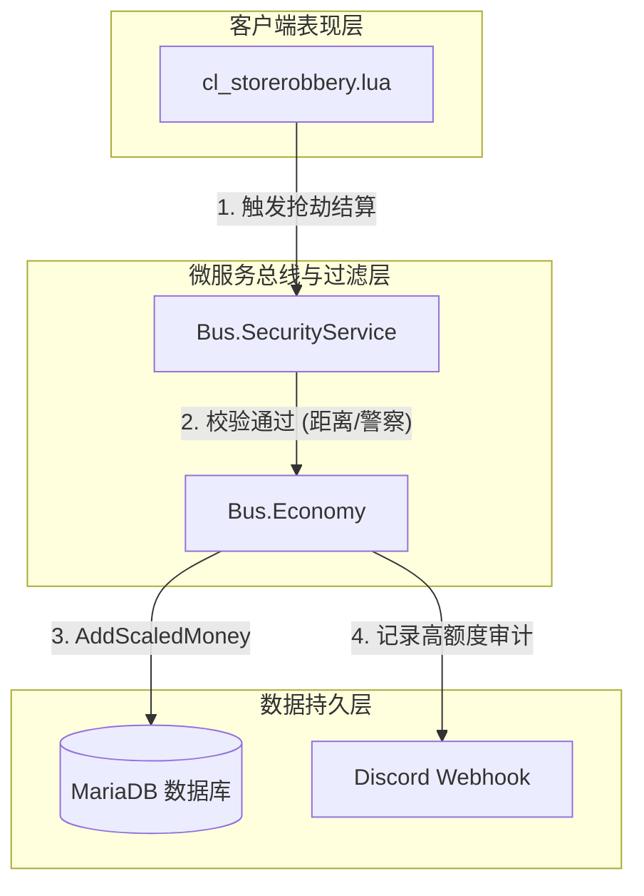

# 📘 T-City Lite 技术手册编写规范 (technical_manual_spec.md)

> **修订日期**: 2026-06-04  
> **使用方法**: 新建独立核心资源或重构大型模块后，必须按本规范在项目文档中输出对应的技术手册（如 `v0.5-maintenance-guide.md`）。

---

## 1. 技术手册命名与存放规范

*   **路径**：所有的技术手册统一存放于 `T-CityLite.base/docs/` 目录下。
*   **命名格式**：`[版本号]-[资源/组件名称]-technical-manual.md`  
    *   例如：`docs/v0.3-banking-refactor-technical-manual.md`。

---

## 2. 技术手册标准大纲与模块规范

每个技术手册必须包含以下六个部分，并严格按此格式排版：

```markdown
# [资源名称] 技术维护手册 (Technical Manual)

> **修订日期**: YYYY-MM-DD  
> **适用版本**: vX.X  
> **维护人/Agent**: [姓名/Agent名称]

---

## 🗺️ 1. 系统架构与数据流图 (Mermaid)
[使用 Mermaid 的 graph TD/LR 画出清晰的客户端、服务端、总线层、缓存层及外部服务的拓扑与数据交互链路。]

## 🔌 2. 导出总线接口与事件契约 (Bus API & Events)
[详细记录本项目注册到 Bus 总线上的服务 exports，以及发布/订阅的事件名。]

### 2.1 注册的服务 (Registered Services)
*   **服务名**: `Bus.[ServiceName]`
*   **暴露方法 (Exports)**:
    *   `exports['service_[ServiceName]_[MethodName]'](args...)` -> 返回值说明

### 2.2 内部事件流 (Internal Network Events)
*   记录该资源监听或触发的所有敏感网络事件，并标明校验状态（RateLimit/距离/职业）。

## 🗄️ 3. 数据库与持久化层变更 (Database Changes)
[记录本项目新增的 SQL 表结构变更、建表语句、虚拟列以及新索引的建立。]
*   **表结构 SQL 语句** (使用 ```sql 块包裹)
*   **索引声明**: 记录建立的联合索引及其解决性能瓶颈的度量指标。

## ⚙️ 4. 全局 Convar 与局部配置项 (Convars & Configs)
[详细列出 configs/modules/*.cfg 下属于本模块的 Convars 默认值及其业务行为影响。]

## 🔄 5. 向后兼容层设计 (Legacy Shim Layer)
[如果有兼容老脚本的设计，必须记录拦截逻辑（如在哪个 legacy_economy_shim.lua 中拦截了旧 API，如何平滑过渡到新微服务）。]

## ⚡ 6. 高性能设计指标 (Performance KPIs)
[对比重构前后，记录该资源的常驻 MS 延迟（CPU 占用）、NUI 帧率、以及数据库 I/O 减少的量化百分比。]
```

---

## 3. Mermaid 图表规范与示例

为了保持手册风格的高度统一，Mermaid 图中统一使用以下定义：
*   `Client` 用 `subgraph` 标识；
*   `Server` 业务层用实体边框；
*   `Database` 用 `[(数据库)]` 圆柱标识；
*   `Discord/Logs` 用外延表示。

**Mermaid 标准样式代码示例**：

```text

```
