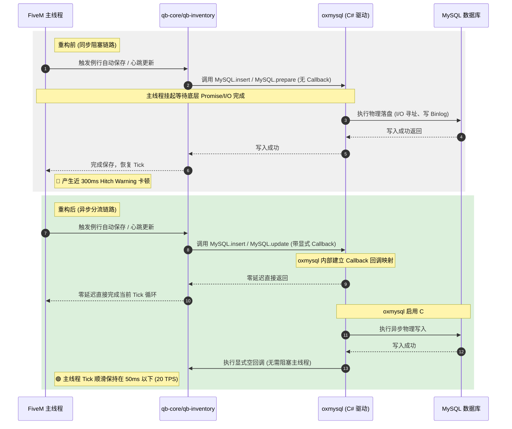

# T-City Lite v0.2 存盘性能优化与数据库异步落盘技术维护文档

本文档详细记录了在 T-City Lite v0.2 版本中，针对“自动存盘导致服务端主线程卡顿（Server Thread Hitch Warning）”的性能问题进行的重构细节。编写此文档旨在方便后续维护、例行排查和二次开发。

---

## 1. 业务背景与性能痛点

在服务器联调测试中，控制台高频出现以下卡顿警告：
```text
[ Script:qb-core] [qb-core:Log] GabrielSong PLAYER SAVED: (FORCE=false)
[ citizen-server-impl] server thread hitch warning: timer interval of 293 milliseconds
```
* **核心成因**：FiveM 服务端采用单线程循环（Tick Loop）。传统的落盘逻辑中，当 `qb-core` 和 `qb-inventory` 触发数据库写入时，底层未设置异步回调函数，或混用了面向 SELECT 预编译设计的 `MySQL.prepare`，造成了主线程的**隐式同步等待**，从而产生了近 300ms 的严重物理卡顿。

---

## 2. 优化技术方案架构设计

本次重构改变了数据库调用的生命周期。下方时序图展示了重构前后的处理链路对比：



---

## 3. 具体修改细节与代码对比

### 3.1 qb-core 在线/离线玩家存盘异步化
* **修改路径**：`d:\txData\T-CityLite.base\resources\[qb]\qb-core\server\player.lua`
* **重构内容**：
  为 `QBCore.Player.Save`（在线自动保存）和 `QBCore.Player.SaveOffline`（离线登出保存）所调用的 `MySQL.insert` 追加**显式异步回调函数**，打断同步等待链。

```diff
-- 修改前 (player.lua L526/L551)
        MySQL.insert('INSERT INTO players ... ', {
            citizenid = PlayerData.citizenid,
            -- ... (基本参量)
            metadata = json.encode(PlayerData.metadata)
        })

-- 修改后 (强制在参数列表尾部注入空回调)
        MySQL.insert('INSERT INTO players ... ', {
            citizenid = PlayerData.citizenid,
            -- ... (基本参量)
            metadata = json.encode(PlayerData.metadata)
+       }, function()
+           -- 显式异步回调，防止数据库操作同步阻塞服务端主线程
+       end)
```

---

### 3.2 qb-inventory 存盘性能重构（Replace `prepare` with `update`）
* **修改路径**：`d:\txData\T-CityLite.base\resources\[qb]\qb-inventory\server\functions.lua`
* **重构内容**：
  1. 背包物品存盘由于包含大量的序列化大 JSON 字符串，原本滥用了 `MySQL.prepare` 导致数据库驱动频繁执行预处理编译。现彻底重构为专门用于物理数据更新的 **`MySQL.update`**。
  2. 同样对 `SaveInventory` 和 `ClearStash` 追加显式异步回调。

```diff
-- 修改前 (functions.lua L120)
-       MySQL.prepare('UPDATE players SET inventory = ? WHERE citizenid = ?', { json.encode(ItemsJson), PlayerData.citizenid })
-   else
-       MySQL.prepare('UPDATE players SET inventory = ? WHERE citizenid = ?', { '[]', PlayerData.citizenid })

-- 修改后 (更换为 MySQL.update 并在末尾注入空回调)
+       MySQL.update('UPDATE players SET inventory = ? WHERE citizenid = ?', { json.encode(ItemsJson), PlayerData.citizenid }, function()
+           -- 显式异步回调，防止数据库操作同步阻塞服务端主线程
+       end)
+   else
+       MySQL.update('UPDATE players SET inventory = ? WHERE citizenid = ?', { '[]', PlayerData.citizenid }, function()
+           -- 显式异步回调，防止数据库操作同步阻塞服务端主线程
+       end)
```
```diff
-- 修改前 (ClearStash 垃圾箱清空落盘 L543)
-   MySQL.prepare('UPDATE inventories SET items = ? WHERE identifier = ?', { json.encode(inventory.items), identifier })

-- 修改后 (更换为 MySQL.update 并在末尾注入空回调)
+   MySQL.update('UPDATE inventories SET items = ? WHERE identifier = ?', { json.encode(inventory.items), identifier }, function()
+       -- 显式异步回调，防止数据库操作同步阻塞服务端主线程
+   end)
```

---

### 3.3 首次登录错峰防抖设计（First-Login Stagger/Jitter）
* **修改路径**：`d:\txData\T-CityLite.base\resources\[qb]\qb-core\client\loops.lua`
* **重构内容**：
  自动代谢扣除和存盘心跳的倒计时在玩家加载成功时启动。若多名玩家在同一时刻上线（或服务器刚重启），其保存周期（5 分钟）会完全重合，造成瞬时的并发写入风暴。
  我们在主循环前增设了**仅在玩家首次上线时触发一次的 1 至 30 秒随机加盐延迟**。

```lua
CreateThread(function()
    local staggered = false
    while true do
        local sleep = 0
        if LocalPlayer.state.isLoggedIn and LocalPlayer.state.isSpawnFinished then
            if not staggered then
                staggered = true
                -- 错峰防抖：首次登录/载入完成后随机延迟 1 至 30 秒，分摊心跳和自动存档的数据库写入压力
                Wait(math.random(1000, 30000))
            end
            sleep = (1000 * 60) * QBCore.Config.UpdateInterval
            local multiplier = CalculateDynamicDecay()
            TriggerServerEvent('QBCore:UpdatePlayer', multiplier)
        else
            sleep = 1000
        end
        Wait(sleep)
    end
end)
```

---

## 4. 后续开发与日常维修指南

> [!WARNING]
> 为了维持服务器物理主线程的 TPS 稳定，后续团队在开发新功能或例行修改时，必须遵守以下几点维修标准：

### 4.1 SQL 执行规范
* **查询选择 (SELECT)**：获取整行数据，优先使用 `MySQL.single.await` 或 `MySQL.query.await`。获取单个值，使用 `MySQL.scalar.await`。
* **数据插入 (INSERT)**：新角色的产生落盘，使用 `MySQL.insert` 且**必须**像本次重构一样，在末尾加入 `function() end` 回调。
* **数据更新 (UPDATE / DELETE)**：使用 `MySQL.update` 代替 `MySQL.prepare`，同样确保加入异步回调。

### 4.2 如何排查未来的 Hitch Warning？
1. **txAdmin 性能分析器**：使用 txAdmin 网页后台的 `Profiler` 模块，抓取 10 秒的服务端 Tick。
2. **分析热点函数**：若瓶颈仍然出现在 `player.lua` 的 `Save` 上，检查是否有第三方资源（如房产、车库、自定义技能系统）挂载了 `QBCore:Server:PlayerSaved` 并在该事件内运行了**同步的**数据库查询（使用 `.await` 后缀）。
3. **隔离第三方存盘**：任何挂载到核心 RP 存档事件上的外部资源，其内部的写操作必须强制移出主线程或转化为异步，否则仍会拖慢整个服务器的性能。

---

本文档已由技术团队完成签署备案。后续如有底层数据迁移或升级至 OxMySQL v3.x，此异步回调设计均可无缝向下兼容。
