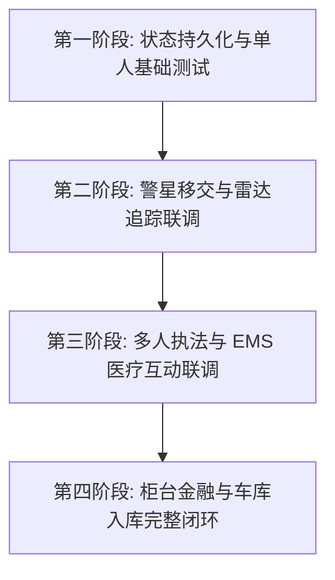

# T-City Lite v0.2 综合测试与实机联调主手册 (Master Test Manual)

本手册是 T-City Lite v0.2 基础 RP 版本的**综合测试主入口**。它将散落在各个资源模块中的测试用例、技术备忘录、测试清单及阶段报告整合为一套结构化的联调指南，供测试工程师与开发团队在单人或多人联调时使用。

---

## 📂 一、测试文档与资源索引 (Test Documents Index)

为方便快速定位具体机制的底层设计 and 分步细节，本手册完整索引了以下测试与技术文档（点击对应链接直接访问）：

### 📝 1. 核心测试用例与清单 (Core Test Checklists)
*   🧪 **基础 RP 模块实机测试清单**：[v0.2-test-checklist.md](file:///D:/txData/T-CityLite.base/docs/v0.2-test-checklist.md)
    *   *内容*：覆盖职业设置、进度条 UI、银行账户存取、车钥匙与公共车库、警察与医院基础 Duty 状态、离线防逃避等基础功能验收。
*   🚨 **警星移交与雷达追踪实机测试指南**：[v0.2-wanted-handover-test-guide.md](file:///D:/txData/T-CityLite.base/docs/v0.2-wanted-handover-test-guide.md)
    *   *内容*：提供 7 大深度核心用例（涵盖 AI 警车撤退、GPS 三角定位脉冲、路人与车辆恐慌力场、警官同僚友好免伤、通缉犯上班 Exploit 拦截、销案良民重置）。

### 🛠️ 2. 技术设计与状态报告 (Technical Memos & Reports)
*   💾 **状态持久化技术备忘录**：[v0.2-status-persistence-technical-memo.md](file:///D:/txData/T-CityLite.base/docs/v0.2-status-persistence-technical-memo.md)
    *   *内容*：生理代谢、残存血量、肢体创伤的持久化数据流设计与 `qb-target` 崩溃防御机制。
*   📜 **状态持久化与底层稳定性测试报告**：[v0.2-status-persistence-test-report.md](file:///D:/txData/T-CityLite.base/logs/v0.2-status-persistence-test-report.md)
    *   *内容*：记录用例一至用例五的真实执行结果，包含多角色状态隔离测试的 **[PASS]** 实测记录。
*   🚓 **警星移交与追踪系统技术维护文档**：[v0.2-wanted-handover-technical-memo.md](file:///D:/txData/T-CityLite.base/docs/v0.2-wanted-handover-technical-memo.md)
    *   *内容*：集成资源 `[custom]/custom-main` 目录结构、`COP` 关系组同僚化、脉冲 Blip 三角定位及 Exploit 拦截机制。
*   🏥 **医院医疗点位优化指南**：[v0.2-hospital-optimization-guide.md](file:///D:/txData/T-CityLite.base/docs/v0.2-hospital-optimization-guide.md)
    *   *内容*：Pillbox 医院区域优化、复活点与 Duty 点物理交互配置。

---

## 🛠️ 二、测试准备与常用指令 (Test Preparation & Commands)

在开始任何阶段测试前，请确保您在服务器中拥有**管理员权限**，并熟悉以下基础指令。

### 🔄 1. 资源热更新与加载
如果您修改了脚本或需要重新载入模块，请在控制台（游戏内按 `F8`）执行以下指令：
```text
ensure custom-main    # 热载自定义生命/无敌/警星通缉与追踪模块
ensure qb-banking     # 热载柜台银行系统
ensure qb-garages     # 热载车库系统
```

### 💬 2. 常用调试指令集
| 指令名称 | 参数格式 | 用途说明 |
| :--- | :--- | :--- |
| `/setjob` | `/setjob [ID] [职业] [Grade]` | 设置职业，如 `police 1`、`ambulance 1`、`unemployed 0` |
| `/duty` | `/duty` | 切换当前职业的上班（On Duty）/下班（Off Duty）状态 |
| `/car` | `/car [载具名称]` | 生成一辆测试载具，例如 `/car taxi` 或 `/car panto` |
| `/clearwanted` | `/clearwanted [ID]` | 作为警官，为指定在逃犯销案，重置为良民状态 |
| `/logout` | `/logout` | 登出当前角色，退回到多角色选择界面 |
| `/disconnect` | `/disconnect` | 立即断开服务器连接，用于测试离线状态保持 |

---

## 🗺️ 三、四阶段系统联调方案 (4-Phase Test Execution Plan)

为了高效完成测试，建议测试组按照以下“由浅入深”的 4 阶段路径开展多人联调：



### 🎯 阶段一：状态持久化与单人基础测试 (Single-player Basics)
*   **测试重点**：验证角色的数据在跨登录、跨角色切换时的一致性，确保无数据丢失。
*   **具体用例**：
    1.  **生理数值下线保持**：消耗食物/水份使饱食度降为 65%，登出 `/logout` 后重新载入，确认 HUD 依然锁定在 65%。
    2.  **残血跨登录保持**：高空摔伤角色（血量降为 130），强退 `/disconnect`，5 秒后重连，确认血量被死死锁在 130，未被强制拉满。
    3.  **倒地强退防逃避**：使自己血量归零倒地，强退游戏。重连进入角色后，确认依然处于倒地休克动画中且红字倒计时继续。
    4.  **肢体伤势与多角色隔离**：大腿骨折瘸腿流血 -> `/logout` 换健康的 B 角色（验证无骨折传染） -> 换回 A 角色（验证骨折与流血大减速完美同步）。
*   **参考文档**：[v0.2-status-persistence-test-report.md](file:///D:/txData/T-CityLite.base/logs/v0.2-status-persistence-test-report.md)

---

### 🚓 阶段二：警星移交与雷达追踪联调 (Wanted Handover - 1~2 Players)
*   **测试重点**：验证自定义 WANTED 通缉接管系统，彻底清除 NPC 警车干扰，实现全服玩家警察围捕。
*   **联调步骤**：
    1.  **平民 1~2 星测试**：平民违法，右上角出现 1~2 颗星，确认只有原生 NPC 警察走过来正常物理追捕。
    2.  **平民 3+ 星移交**：继续犯罪直至 3 星，确认原生警星**瞬时清零**，周围 NPC 警车与直升机立即撤退退场；屏幕弹出红字 WANTED 警报，在逃通缉状态锁定。
    3.  **雷达脉冲定位**：在逃犯保持移动；警察玩家输入 `/setjob [自己] police 1` 并打卡 `/duty`。确认警员大地图上每 8 秒跃迁刷新一次红色闪烁警标 Blip，并自动绘制追踪红线；在逃犯下线 12 秒后红点自动销毁。
    4.  **路人恐慌力场**：在逃犯步行或驾车靠近散步的市民 NPC 或街角等红绿灯的车辆（25米内），确认步行 NPC 抱头尖叫逃跑，市民司机会猛踩地板油极速飙车撞开障碍物逃离。
    5.  **警官同僚化免疫**：警员上班状态下，锁定 Wanted Level 为 0，且用拳头击打或开枪误伤 NPC 警察，确认 NPC 同僚头上不显红点且绝对不反击。
    6.  **在逃犯上班拦截 (Exploit 防御)**：警官处于 `offduty` 状态下犯罪触发 3+ 星通缉。尝试打卡 `/duty`，验证指令与物理柜台是否被强力拦截并弹出红字警告，防止利用警察特权“逃课”洗白。
    7.  **销案良民重置**：警官对逃犯执行 `/clearwanted [ID]`，确认雷达红点彻底注销。嫌疑人重新违规，确认能重新触发 1~2 星 NPC 警察通缉，完美重置为民事网。
*   **参考文档**：[v0.2-wanted-handover-test-guide.md](file:///D:/txData/T-CityLite.base/docs/v0.2-wanted-handover-test-guide.md)

---

### 🏥 阶段三：多人执法与 EMS 医疗互动联调 (Interactions - 2+ Players)
*   **测试重点**：测试警察与医生在面对其他玩家时的物理菜单与 NUI 进度条交互。
*   **联调步骤**：
    1.  **进度条 (progressbar) 动作打断**：执行急救或搜身时，确认屏幕中央进度条正常倒计时。中途移动或按 `ESC` 键，确认进度条能瞬间打断且动画停止。
    2.  **警察专属执法动作**：警察靠近另一名平民玩家，依次测试**搜身 (Search)**（确认可以翻阅对方背包）、**戴手铐 (Cuff/Uncuff)**（对方播放戴手铐动画且被锁死行动）、**护送 (Escort)**（对方被强行吸附并随警员行走）。
    3.  **EMS 现场急救**：玩家 A 血量归零进入倒地休克。玩家 B 切换为 EMS (`/setjob [B] ambulance 1` / `/duty`)，携带急救包/除颤器对 A 现场施救，验证 A 是否顺利解除休克并带着残存血量站起。
    4.  **医院床位康复流**：A 倒地死亡倒计时结束后，长按 `E` 键请求医院复活。验证 A 是否被顺利传送至 Pillbox 医院物理床位上，且血量部分恢复，同时扣除医疗费。
*   **参考文档**：[v0.2-test-checklist.md](file:///D:/txData/T-CityLite.base/docs/v0.2-test-checklist.md)

---

### 🏦 阶段四：柜台金融与车库入库完整闭环 (Teller & Garages - 1~2 Players)
*   **测试重点**：验证纯柜台交易安全性、对账单生命周期，以及车辆物理钥匙与车库存取闭环。
*   **联调步骤**：
    1.  **纯柜台交互**：靠近银行网点柜台，按 `E` 唤起 UI。确认 **没有** 任何办卡、ATM 选项（物理卡与 ATMs 已废除）。验证右上角 Citizen 姓名与 Pocket Cash 和身上拥有的现金数值保持一致。
    2.  **存取款与转账流水**：对 Checking 存入 `$1,000` 并填写备注，再取出 `$500`。确认钱包资金同步扣增。检查底部流水（Statements），确认准确新增一绿一红两条明细。
    3.  **子账户开户、销户与退款**：在 Sidebar 开设共享子账户 `Project-A`，初存 `$2,000`；向其单独存取测试；之后在 Access Control 中点击销户，确认 `Project-A` 卡片销毁，余额全额退回 Checking 且自动新增退款流水。
    4.  **防“幽灵账单”串卡测试**：保持在线，重新创建一个同名子账户 `Project-A`。检查下方流水，确认**有且仅有**本次创建的 Initial deposit 记录，前一个旧 `Project-A` 账户的任何交易历史**完全消失，无任何脏数据继承**。
    5.  **车辆钥匙与车库存取**：
        *   *用例 A (车店/购买车辆)*：驾驶属于个人所有的个人载具前往车库，在交互点存车，验证车辆消失且数据库 `player_vehicles` 状态置为 `stored`；随后在面板中无阻取出，且车牌和外观完好。
        *   *用例 B (Car Adder 召唤车辆 - 已知 Bug)*：使用临时载具生成器召唤车辆，尝试存入公共车库。**确认车库是否抛出拒绝提示，并将该 Bug 记录至下方反馈板**。
*   **参考文档**：[v0.3-banking-refactor.md](file:///D:/txData/T-CityLite.base/docs/v0.3-banking-refactor.md)

---

## 🔴 四、测试故障反馈板 (Bug Tracker - ALL RESOLVED)

测试组在测试过程中如遇到任何故障或报错，请记录在此。当前历史报错均已关闭：

### 🟢 1. [BUG-02-01] 公共账户双括号显示故障 [已解决 / RESOLVED ✅]
*   **发现人**：测试组 & 玩家反馈
*   **当前状态**：**已解决**。
*   **修复结论**：玩家已成功排查并修改了配置，去除了名称中不当的括号结构，目前公共账户（Job/Society Accounts）名称显示清爽正常。

### 🟢 2. [BUG-02-02] Car Adder 临时车辆无法入库限制 [已关闭 / VERIFIED ✅]
*   **发现人**：测试组 & 玩家反馈
*   **当前状态**：**已关闭（非 Bug，符合设计逻辑）**。
*   **定性结论**：`qb-garages` 的设计边界要求存车必须核对数据库中的车辆注册车牌与所属者 CID 关联。Car Adder 召唤的是非注册 of 临时演示车辆，不应该允许存入个人永久车库。此行为完全符合 RP 机制与系统安全逻辑，判定为**合理机制**，无需代码变动。
