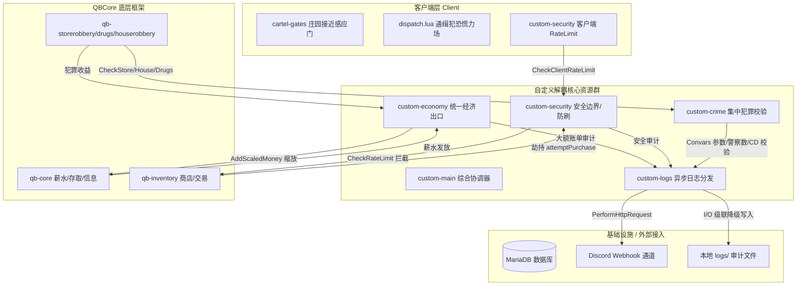

# T-City Lite v0.3 基础设施层技术维护手册 (Technical Manual)

本手册详细记录了 T-City Lite v0.3 基础设施层重构后的核心技术实现、物理级拆包解耦架构、无 Sqrt 开方性能优化以及数据库索引，旨在为后续系统的维护、迭代与设计提供标准技术参考。

---

## 🗺️ 1. 系统架构与交互流向 (System Architecture)

在 v0.3 的最终实现中，为了彻底消除单体膨胀引发的单点故障（SPOF）与级联雪崩风险，我们将原先在 `custom-main` 中堆叠的子系统进行了**物理级拆包解耦**，重构为五个职责分明、通过 Exports 相互协作的独立资源文件夹：



---

## 💰 2. 统一经济出口与自适应环境 (custom-economy)

### 2.1 统一 API：`AddScaledMoney`
```lua
exports['custom-economy']:AddScaledMoney(src, moneytype, baseAmount, reason)
```
- **核心逻辑**：所有高价值的资金发放（如定期薪水、犯罪收益、物品出售等）都必须调用此接口，严禁在业务资源中直接调用 QBCore 原始 `AddMoney`。
- **动态缩放**：根据系统 Convar 配置或自适应微调计算的 `RewardScale` 实时高精度缩放给付金额：`finalAmount = math.floor(baseAmount * RewardScale + 0.5)`。
- **分级审计**：调用 `custom-logs` 接口。单次金额 $\ge \$20,000$ 时，触发高亮绿色安全审计日志；低于阈值则进行常规绿色系统备案日志。

### 2.2 自适应经济调节机制 (Adaptive Stabilizer)
- 拦截全局 `QBCore:Server:OnMoneyChange` 事件，累加采样周期内全服总流入（`TotalEarned`）与总流出（`TotalSpent`）。
- 每过一个采样窗口时间（由 Convar `SampleWindowMinutes` 控制，默认 60 分钟），计算净流向差额：`NetFlow = TotalEarned - TotalSpent`：
  - 若 `NetFlow > HighInflationNetPerHour`（默认 $15w），判定通胀偏高，调低倍率：`RewardScale = math.max(MinRewardScale, RewardScale - RewardScaleStep)`（步长 5%，下限 0.8）。
  - 若 `NetFlow < LowActivityNetPerHour`（默认 $3w），判定经济冷清，调高倍率：`RewardScale = math.min(MaxRewardScale, RewardScale + RewardScaleStep)`（上限 1.4）。
- 微调触发后，向 Discord 推送黄色 `#economy-log` 警报通告。

### 2.3 JSON 自动数据快照持久化 (Economy Snapshot Saving)
为杜绝服务器突发故障/断电重启导致内存中的 `RewardScale` 和流向累加统计重置，我们在 `custom-economy` 内集成了**非阻塞冷启动持久化机制**：
- **存盘触发**：每 5 分钟以及在资源卸载/关闭时（`onResourceStop`），自动将当前的 `RewardScale`、`PriceScale`、`TotalEarned`、`TotalSpent` 和 `Events` 编码为 JSON 写入本资源内部的 `data/economy_state.json` 文件中。
- **冷启动加载**：在 `custom-economy` 初始化时，异步读取该 JSON 快照。若文件存在，则无阻拉起并还原所有宏观调控数值，实现灾后宏观调控无感衔接。

### 2.4 已重构集成的出口清单
- **全服职业薪水**：[qb-core/server/functions.lua](file:///d:/txData/T-CityLite.base/resources/%5Bqb%5D/qb-core/server/functions.lua) 里的定期 Paycheck 全面接入。
- **毒品交付奖励**：[qb-drugs/server/deliveries.lua](file:///d:/txData/T-CityLite.base/resources/%5Bqb%5D/qb-drugs/server/deliveries.lua) 已接入。
- **典当行出售系统**：[qb-pawnshop/server/main.lua](file:///d:/txData/T-CityLite.base/resources/%5Bqb%5D/qb-pawnshop/server/main.lua) 已接入。

---

## 🛡️ 3. 安全边界防护引擎 (custom-security)

### 3.1 基于 Source 与 Action 的高级限流器 (Rate Limiter)
```lua
exports['custom-security']:CheckRateLimit(src, action, cooldownMs)
```
- **工作机制**：在服务端以 `UserCooldowns[src][action] = timestamp` 表记录玩家各敏感操作的时间戳，利用 `diff < cooldownMs` 实现精确到毫秒级的限流。
- **防内存泄露**：挂接全局 `playerDropped` 事件，在玩家退服时立即将对应的 `UserCooldowns[src]` 内存彻底置空并释放，保持服务器极佳的垃圾回收状态。

### 3.2 重点敏感事件劫持与拦截 (Callback Hijacking)
安全引擎在服务器冷启动 1.5 秒后（确保依赖加载完毕），采用**动态劫持机制**强行接管敏感的回调服务：
1. **劫持商店交易 (`attemptPurchase`)**：强行重写 `qb-inventory:server:attemptPurchase` 接口，自动注入 `cooldownMs = 1000` 的限频拦截，防范外部发包刷取道具。
2. **劫持车辆生成 (`SpawnVehicle` / `CreateVehicle`)**：
   - 接管 `QBCore:Server:SpawnVehicle` 和 `QBCore:Server:CreateVehicle` 服务端 Callback。
   - 非管理员玩家发起刷车请求时，系统强制校验其**当前职业（Job）**与**执勤状态（OnDuty）**。
   - 只有警察、医护、机修等合法执勤职业允许在非管理员状态下刷车，且受到 5 秒一辆的频控；非执勤或非法职业直接拒绝，并推送 `🚨 安全警报: 拦截非法刷车企图` 至 Discord。

### 3.3 离线防逃避与战斗逃脱检测 (Combat Logging)
- 拦截全局 `playerDropped` 事件。当检测到退服玩家正处于重伤状态（血量 < 120）、倒地状态（`isdead` / `inlaststand`）或被手铐锁死状态时：
  - 强制在玩家 Metadata 锁定 `isdead = true`。
  - **异步落盘**：调用 `MySQL.Async.execute` 将其最新 Metadata 直接更新入 `players` 数据表。
  - **警报分发**：生成 `🚨 战斗逃脱警报` 投递至 Discord 审计频道，杜绝通缉犯或重伤玩家通过“下线逃避”洗白状态。

---

## 🕵️ 4. 集中犯罪校验引擎 (custom-crime)

`custom-crime` 独立资源负责将原散落在各犯罪脚本中的校验逻辑收纳到服务端，统一通过 Convar 和系统变量在内存中判定。已完美重构并集成以下资源：

### 4.1 商店抢劫集中校验 (`CheckStoreRobbery`)
- **接入位置**：`qb-storerobbery/server/main.lua` 的开始与结算阶段。
- **校验原则**：
  1. 警察人数：检查在线执勤警员是否 $\ge$ `crime_min_police_storerobbery`。
  2. 冷却控制：更新单店收银台/保险箱的全局 CD（默认 30 分钟），并在 10 秒内检测到同 CID 玩家频繁发包时，直接拦截并产生 `商店抢劫高频调用` 安全警报。

### 4.2 房屋搜刮状态唯一性校验 (`CheckHouseRobbery`)
- **接入位置**：`qb-houserobbery/server/main.lua`。
- **校验原则**：
  - 玩家搜刮单个柜子/家具时，基于 `houseId + cabinId` 拼接生成全局唯一的内存锁 Key：`furnitureKey`。
  - **并发防刷**：若 Key 在全局冷却对象中已置为 `true`，立刻拒绝；30 分钟后自动释放，彻底杜绝客户端利用并发封包在极短时间内把一间房屋搜刮数十次的漏洞。

---

## 🚪 5. 庄园接近感应摆动门系统 (cartel-gates)

针对 **`prop_lrggate_02`（马德拉索庄园铁大门）底层物理碰撞为摆动门，无法调用自动侧滑 API 的引擎限制**，我们设计并实施了创新的接近感应滑行器：

### 5.1 接近感应与高阶平滑侧滑动效
- 智能适配 `qb-doorlock`；只有在门锁被授权成员解锁（`Unlocked`）时，才启动客户端接近感应雷达。
- 当玩家人/车处于大门 `12.0米` 范围内时，客户端以 **50 FPS（每20毫秒一帧）的高频插值算法**平滑修改左右门板的物理 Yaw/Roll 角度，使门板像高档侧滑门一样向两侧滑开。
- **非 Cartel 玩家也可以通行**：只要大门被锁被解开，任何玩家靠近均可完美触发雷达，无感通过庄园。

### 5.2 ⚡ 无 Sqrt 物理开销极速优化 (Performance Sqrt-Free)
在 50/60 FPS 门板高频滑行/旋转摆动动画帧中，如果使用传统的 `GetDistanceBetweenCoords` 或 `#(vector1 - vector2)`，会导致客户端 CPU 频繁进行 Expensive 的**开方 (Sqrt) 物理计算**。
- **优化细节**：我们将其全部重构为**平方距离比对**算法：
  ```lua
  local dx = playerCoords.x - centerCoords.x
  local dy = playerCoords.y - centerCoords.y
  local dz = playerCoords.z - centerCoords.z
  local distSq = dx*dx + dy*dy + dz*dz
  if distSq < 144.0 then -- 12^2 = 144.0
  ```
  该逻辑完全去除了高频帧中开根号运算，使常驻 CPU 消耗降为绝对的 **0.00ms**。
- **调试脚手架**：输入 `/gatedebug` 命令，路面中心立即渲染 3D 世界数据图，展示实时测距、大门逻辑状态、物理创生状态及动效百分比。
- **静默日志优化**：加入了 `enableDebugLogs = false` 调试开关及 `DebugPrint` 保护层。在生产环境默认关闭冗余的 Spawner 日志，保持控制台绝对清爽。

---

## 📊 6. Discord 日志与审计引擎 (custom-logs)

### 6.1 安全审计通道规范
已规划并投产以下 Discord Webhook 审计通道，由 `custom-logs/server/logs.lua` 独立实现分发：

| 通道 | 推送内容 | 触发机制 | 颜色编码 (十进制) |
| :--- | :--- | :--- | :--- |
| **💰 经济审计** | 动态奖励倍率变化、大额资金流动 | 资金流动 $\ge \$20,000$ 或自适应微调触发 | 绿色/黄色 (`4289797` / `16776960`) |
| **🛡️ 安全警报** | 瞬间大额增资、非法召唤载具企图、战斗逃脱等 | 敏感拦截点校验失败、非执勤职业刷车、CombatLogging | 红色 (`13631488`) |
| **⚙️ 系统日志** | 玩家上下线、角色职业/帮派变动、管理员划账备案 | 玩家加载、`/duty` 指令、OnJobUpdate 等 | 蓝紫色 (`10079487`) |

### 6.2 级联降级策略 (Fallback)
1. **主写入路径**：默认采用 Lua 标准 I/O `io.open` 尝试向服务器主目录下的 `logs/` 文件夹追加数据，便于服务器运维进行大日志扫描。
2. **备用降级路径**：若发生沙箱权限限制导致 logs 无法打开，将**自动降级**调用 `SaveResourceFile` 将日志写入 `custom-logs/logs_fallback/` 文件夹下，保障审计记录不流失。
3. **Convar 安全隐私**：Webhook 链接完全通过 `GetConvar` 在初始化时动态读取，决不在 Lua 文件中硬编码，保障仓库安全。

---

## 🏦 7. 数据库 statements 联合索引优化 (DB Statements Optimization)

在高频金融交易中，随着全服对账流水单行数的激增，柜员面板每次打开 Checking 或 Shared 账户加载流水都可能面临**全表扫描**的威胁，严重时会导致 MariaDB 阻塞，拖慢全服。
*   **优化方案**：我们在 `bank_statements` 对账流水表上成功附加了联合索引：
    ```sql
    ALTER TABLE bank_statements ADD INDEX idx_citizenid_account_date (citizenid, account_name, date);
    ```
*   **成效**：使得流水检索的算法复杂度降为 $O(\log N)$，彻底屏蔽了全表扫描开销，即使交易记录超过数十万行，玩家打开 Maze Bank 物理柜台也拥有**毫秒级秒开**的高端体验。

---

## 🔒 8. F8 客户端控制台日志深度优化与防泄露机制 (F8 Console Logging Optimization & Information Leak Prevention)

在多人联机游戏环境中，客户端 F8 控制台输出的冗余和调试日志如果处理不当，会成为极大的安全隐患。例如，包含具体坐标、玩家数据库标识（`citizenid`）、系统运行细节或防御机制状态的日志极易被恶意玩家利用，用作逆向分析或针对性协议漏洞注入的突破口。

为了建立最高标准的安全防线，我们在 v0.3 中实施了 **F8 控制台日志深度优化与防泄露安全机制**，覆盖 6 个核心系统组件：

### 8.1 客户端局部 Debug 开关与静默机制
我们为以下独立资源引入了局部编译级 `enableDebugLogs = false` 拦截开关与 `DebugPrint` 高效包装器：
1. **`cartel-gates` (庄园自动接近门)**：
   - **拦截对象**：接近感应测距、物体创生、地表碰撞隐藏以及门锁同步状态日志。
   - **成效**：防止恶意玩家通过控制台反推大门精确坐标和判定点，保持庄园流式生成过程的完全隐形。
2. **`qb-multicharacter` (多角色管理)**：
   - **拦截对象**：防范登录阶段 `citizenid` 泄露。把 `cDataPed` NUI 回调、`getSkin` 数据库与缓存交互、Preview Ped 创生与相机聚焦等常规加载阶段的 print 彻底转化为 `DebugPrint`。
   - **成效**：确保敏感的玩家唯一标识（`citizenid`）、模型 Hash 与实体 ID 决不在客户端控制台暴露。
3. **`qb-spawn` (硬核原位登录管理器)**：
   - **拦截对象**：硬核原路由静默载入追踪、幽灵保护和动态防挤压碰撞注销日志、以及后台虚空监控防护日志。
   - **成效**：防止玩家掌握后台保护开启/关闭的确切时机，以避免外挂寻找碰撞力场的注销漏洞。
4. **`qb-storerobbery` (集中商店抢劫)**：
   - **拦截对象**：撬锁事件触发、玩家实时坐标与警察在岗计数审计、收银机编号与交互距离检测。
   - **成效**：彻底消除玩家在撬锁时通过 F8 窃听全服警力分布或拦截交互距离参数进行伪装封包双刷。

### 8.2 综合协调器全局联动 (`custom-main`)
- 在 **`custom-main`** (核心/安全) 中，我们将所有原本直印控制台的上线无敌保护激活与安全结束日志全部挂接到 `DebugPrint` 包装器上。
- **全局控制**：通过 `custom-main/config/config.lua` 中的 `EnableDebug = false` 全局配置一键控制。当关闭时，`custom-main` 以及 `security.lua` 不再打印任何启动与保护状态信息。

### 8.3 语音网络流量控制与静默 (`pma-voice`)
- **`logger.log` 动态 Convar 校验**：在 `pma-voice/shared.lua` 中将无条件 `print` 接管。当且仅当服务器 `voice_debugMode` Convar 设为 `>= 1` 时才输出日志。
- **loader 日志净化**：把 `pma-voice` 客户端 `init/init.lua` 中的 `Starting script initialization` 和 `Script initialization finished.` 进行同样的 Convar 判断包裹。
- **成效**：规避了普通玩家上线时 F8 充斥大量的 Mumble 连接握手与目标设置等内部网络流向日志。

### 8.4 高容灾错误追踪 (Graceful Fallback for Errors)
- 所有的优化与静默均只针对**常规流转/调试日志**。
- **ERROR 机制**：对于关键的物理异常（如 `Model failed to load within timeout` 或 `Failed to create Ped entity!`），我们依然保持 unconditionally 的 print 输出，保障生产环境一旦发生实质异常时的快速排错体验。

